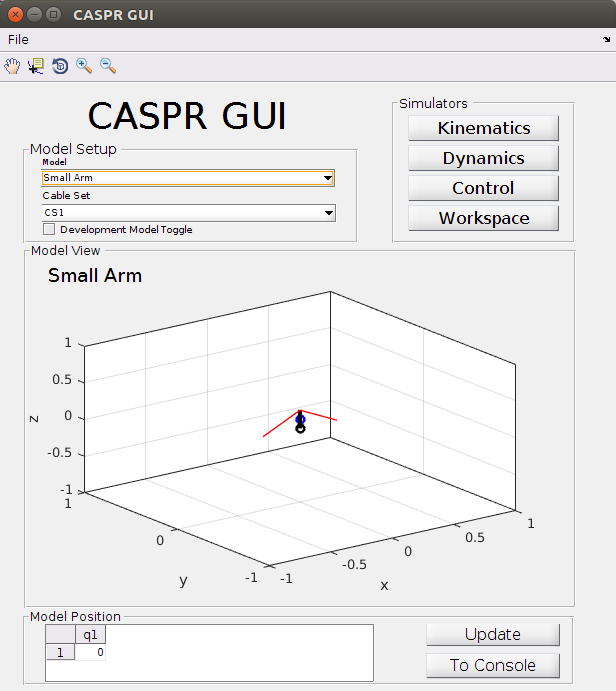
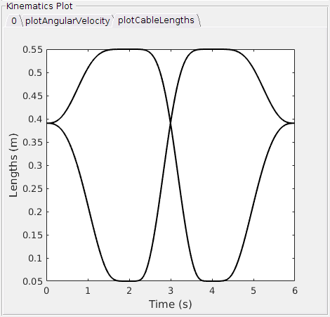

# What is CASPR?
CASPR is a opensource simulation tool, written in MatLab. It is developed for researching purposes in the area of tendon driven robots, so called CDPRs (Cable-driven parallel robots). Basically the simulation software is able to perform analysis in the following fields of study:

* Dynamics and Control
* Forward Dynamics
* Inverse Dynamics
* Motion Control
* Kinematics (Forward Kinematics, Inverse Kinematics)
* Workspace Analysis
* Design Optimisation

CASPR provides a GUI, which allows easy and intuitive access to the to main functions.
In general one starts by chosing a robotic model. These models are simplifications of the actual robots one is interested in. Robot models in CASPR are basically build with three different primitives:

1. Links
2. Joints
3. Cables

Where links and cables are straight lines with predefined start and end positions in space and joints provide the connection between the links. The image below depicts the CASPR GUI, where you can see a primitive robot model, a simple arm with just one joint. It is visualized in the 3D coordinate system. The black lines are the links, black circles the joints, blue circles center of masses and the red lines are the cables / tendons. The model position at the bottom of the picture shows the initial joint angle.

CASPR models are always build of three .xml files. One file for the body description (links, joints, center of masses), one for the cables (attachment points) and another file describing a joint trajectory. How we build our won model will be described later.

Is a robot model chosen, one can start the desired simulation. In our case this is inverse kinematics. What CASPR now basically does is, that it sets the joint angles accordingly to the joint trajectory, that is described in the xml file. This makes the robot move its links and therefore increase / decrease the cables, as these have a fixed starting point in space and a fixation on arbitrary locations of the robot's links. This means cables are stretching or tightening. This change in length is exactly what we need for our inverse kinematics, as we can use cable lengths to calculate motor commands.

After successfull simulation the CASPR GUI offers a varity of output calculations. You can plot a video, visualize the robot's movement or / and plot several outputs, like cable lengths, velocity, acceleration, etc. It is also possible to execute these calculations without the GUI, by running a script. I will explain this in the PaBiLegs example below. The figure below shows an as an example how such an cable length output could look like. in this case the link moved along the y axis to 90°, followed by -90° and finally back to the initial position of 0°.

# What is CASPROS?
The difference between CASPR and CASPROS is basically that CASPROS works completely on C++ and is accessible by. it also does not provide a GUI and outputs not cable lengths, but motor commands to control real robots. So CASPROS is the linkage we need to control Roboy, while CASPR offers us a tool for simulation and research purposes, e.g. validating our robot models.
